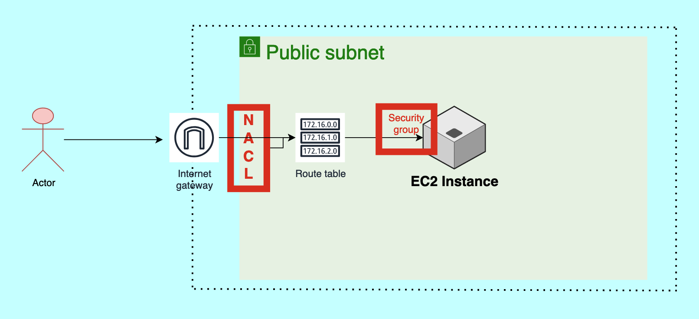

### Security Groups:
    Security Groups act as virtual firewalls for Amazon EC2 instances (virtual servers) at the instance level. They control inbound and outbound traffic by allowing or denying specific protocols, ports, and IP addresses.
    Each EC2 instance can be associated with one or more security groups, and each security group consists of inbound and outbound rules.
    Inbound rules determine the traffic that is allowed to reach the EC2 instance, whereas outbound rules control the traffic leaving the instance.
    Security Groups can be configured using IP addresses, CIDR blocks, security group IDs, or DNS names to specify the source or destination of the traffic.
    They operate at the instance level and evaluate the rules before allowing traffic to reach the instance.
    Security Groups are stateful, meaning that if an inbound rule allows traffic, the corresponding outbound traffic is automatically allowed, and vice versa.
    Changes made to security group rules take effect immediately.

### Network Access Control Lists (NACLs):
    NACLs are an additional layer of security that operates at the subnet level. They act as stateless traffic filters for inbound and outbound traffic at the subnet boundary.
    Unlike Security Groups, NACLs are associated with subnets, and each subnet can have only one NACL. However, multiple subnets can share the same NACL.
    NACLs consist of a numbered list of rules (numbered in ascending order) that are evaluated in order from lowest to highest.
    Each rule in the NACL includes a rule number, protocol, rule action (allow or deny), source or destination IP address range, port range, and ICMP (Internet Control Message Protocol) type.
    NACL rules can be configured to allow or deny specific types of traffic based on the defined criteria.
    They are stateless, which means that if an inbound rule allows traffic, the corresponding outbound traffic must be explicitly allowed using a separate outbound rule.
    Changes made to NACL rules may take some time to propagate to all the resources using the associated subnet.

