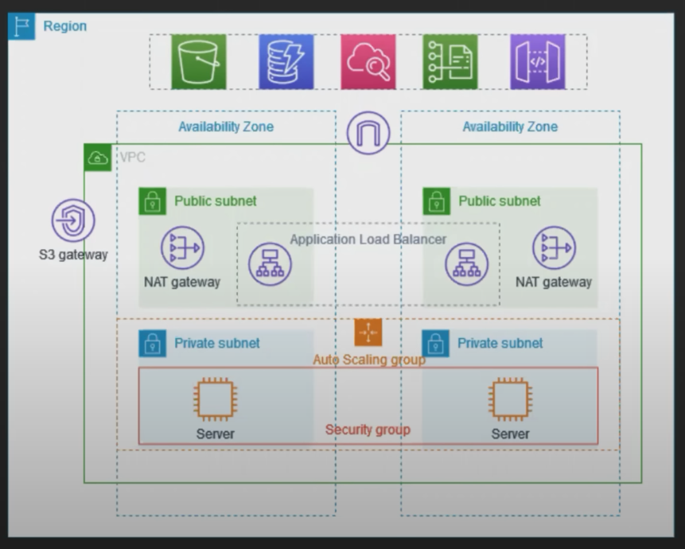

Example demonstrating how to create a VPC that we can use for servers in a production environment.

## Overview
- The VPC has public subnets and private subnets in two AZs.
- Each public subnet contains a NAT gateway and a load balancer node.
- The servers running in the private subnets, are launched and terminated by using an auto scaling group, and receive traffic from the load balancer.
- The servers can connect to the internet by using the NAT Gateway.